<div align="center">
  
  <!-- dynamic typing effect 动态打字效果 -->
  <div align="center">
    <a href="https://blog.sunguoqi.com/">
      
    </a>
  </div>

  <!-- knock code pictures 敲代码的图片 -->
  <br>

  <!-- profile logo 个人资料徽标 -->
  <div align="center">
    <a href="https://popcornboom.github.io/"></a>&emsp;
    <a href="https://space.bilibili.com/271218438"></a>&emsp;

    <!-- visitor statistics logo 访客数统计徽标 -->
    
  </div>


#  🙋 Hello

<table>
<tr><td>

<!-- About me 关于我 -->
### 🤺 About Me


<p>&emsp;&emsp;大家好，我是小孙同学。</p>
<p>&emsp;&emsp;热爱编程、摄影、读书、旅行。</p>
<p>&emsp;&emsp;热爱计算机科学和IT互联网事业，励志成为一名优秀的独立开发者。</p>
<p>&emsp;&emsp;我们正在让这个世界变得更加美好，通过代码的重复使用和延展构建完美体系。</p>
<p><strong>&emsp;&emsp;We're making the world a better place. Through constructing elegant hierarchies for maximum code reuse and extensibility.</strong></p>

</td></tr>

<tr>
<td>
  
### 🏢 Work Experience

帮爹写前端


### 📊 WakaTime

<picture>
  <source
    srcset="https://github-readme-stats.vercel.app/api/wakatime?username=POPCORNBOOM
&layout=compact&text_color=f0f6fc&bg_color=00000000&hide_border=true&hide_title=true"
    media="(prefers-color-scheme: dark)"
  />
  <source
    srcset="https://github-readme-stats.vercel.app/api/wakatime?username=POPCORNBOOM
&layout=compact&text_color=1f2328&bg_color=00000000&hide_border=true&hide_title=true"
    media="(prefers-color-scheme: light), (prefers-color-scheme: no-preference)"
  />
  
</picture>

</td></tr>

<tr><td>

<!--START_SECTION:waka-->
**I'm a Night 🦉** 

```text
🌞 Morning                270 commits         █████░░░░░░░░░░░░░░░░░░░░   19.45 % 
🌆 Daytime                416 commits         ███████░░░░░░░░░░░░░░░░░░   29.97 % 
🌃 Evening                497 commits         █████████░░░░░░░░░░░░░░░░   35.81 % 
🌙 Night                  205 commits         ████░░░░░░░░░░░░░░░░░░░░░   14.77 % 
```
📅 **I'm Most Productive on Friday** 

```text
Monday                   207 commits         ████░░░░░░░░░░░░░░░░░░░░░   14.91 % 
Tuesday                  184 commits         ███░░░░░░░░░░░░░░░░░░░░░░   13.26 % 
Wednesday                177 commits         ███░░░░░░░░░░░░░░░░░░░░░░   12.75 % 
Thursday                 143 commits         ███░░░░░░░░░░░░░░░░░░░░░░   10.30 % 
Friday                   353 commits         ██████░░░░░░░░░░░░░░░░░░░   25.43 % 
Saturday                 147 commits         ███░░░░░░░░░░░░░░░░░░░░░░   10.59 % 
Sunday                   177 commits         ███░░░░░░░░░░░░░░░░░░░░░░   12.75 % 
```


📊 **This Week I Spent My Time On** 

```text
🕑︎ Time Zone: Asia/Shanghai

💬 Programming Languages: 
Vue.js                   27 hrs 19 mins      ██████████████████████░░░   86.11 % 
TypeScript               1 hr 47 mins        █░░░░░░░░░░░░░░░░░░░░░░░░   05.65 % 
Markdown                 59 mins             █░░░░░░░░░░░░░░░░░░░░░░░░   03.12 % 
JSON                     50 mins             █░░░░░░░░░░░░░░░░░░░░░░░░   02.67 % 
JavaScript               16 mins             ░░░░░░░░░░░░░░░░░░░░░░░░░   00.89 % 

🔥 Editors: 
VS Code                  31 hrs 43 mins      █████████████████████████   100.00 % 

💻 Operating System: 
Windows                  29 hrs 49 mins      ████████████████████████░   94.00 % 
Mac                      1 hr 54 mins        ██░░░░░░░░░░░░░░░░░░░░░░░   06.00 % 
```


 Last Updated on 25/07/2023 01:43:50 UTC
<!--END_SECTION:waka-->
  
</td></tr>
</table>

<!-- ########################################## 分割 ########################################## -->


<div align="center" >



<!--  skill badge 技能徽章 -->
💪 正在学习


  
🧠 计划学习


🧰 常用的工具


<!-- programming tool icon 编程工具图标 -->
<br>

<!-- svg -->


 


<br>


<!-- Github-Stats-Terminal 终端风格信息 -->
<br>
  
<!-- Quotes 名人名言 -->
<br>
  
<!-- GitHub 奖杯🏆 -->
<br>

<!-- GitHub 数据统计 -->

<br><br>


<!-- GitHub Activity Graph GitHub 活动图 -->
<table align="center">
  <tr>
    <td></td>
  </tr>
</table>

</div>


